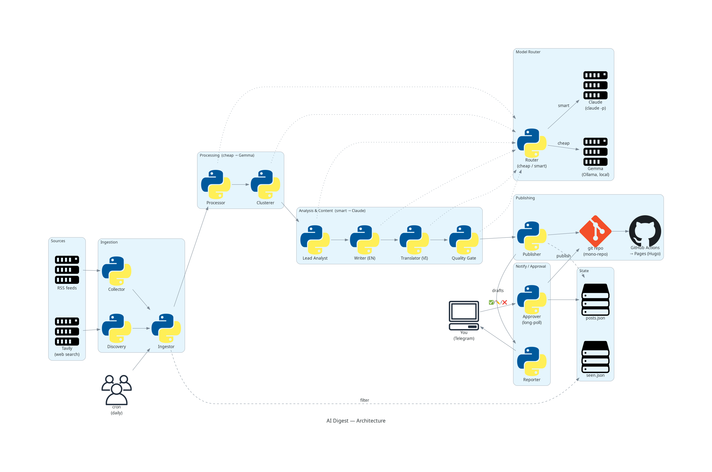

AI Digest is a self-hosted **multi-agent pipeline**. Each day it gathers AI/tech
news, processes it with a cheap model, writes and translates blog posts with a
strong model, runs a quality gate, and publishes a bilingual static site — with an
optional human-in-the-loop approval step over Telegram.

## The reusable core: a Model Router

Every agent asks for a *tier* — `cheap` or `smart` — never a specific provider. The
**Model Router** maps tiers to backends, configurable via `model_mode`:

- **claude_only** — both tiers → Claude (fast, no local GPU heat)
- **both** — cheap → Gemma (Ollama, local), smart → Claude
- **ollama_only** — both tiers → Gemma (fully local)

A second seam, the **Search interface**, wraps the web-search provider (Tavily).

## Pipeline stages

| Stage | Tier | Role |
|-------|------|------|
| Collect | — | Parse RSS feeds (tolerant per feed) |
| Discover | cheap | Daily web search + relevance filter |
| Ingest | — | Merge sources, dedupe, drop already-seen |
| Process | cheap | Per-article summary + category + tags |
| Cluster | cheap | Group articles about the same story |
| Analyze | smart | Synthesize + prioritize into a digest |
| Write | smart | One blog post per story, with citations |
| Translate | cheap→smart | EN→VI, keeping technical terms in English |
| Quality gate | smart | Block fabricated / ungrounded posts |
| Publish | — | Render Markdown, commit, push |

## Publishing & CI/CD

The Publisher writes **generator-neutral** Markdown (plain CommonMark + front-matter,
no Hugo shortcodes) so the site generator stays swappable. On push, GitHub Actions
builds the Hugo site (homepage by day, EN/VI i18n, category/tag taxonomy) and deploys
to GitHub Pages.

## Resilience

Every model-calling agent degrades gracefully on bad output — one broken feed, failed
search, or rejected post never sinks the run. A daily Telegram report summarizes counts,
stage timings, and any issues with their likely cause and fix.
